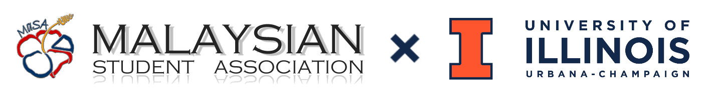

# Introduction {-}

<small><center> Mobile users: use the burger icon at the top-left to navigate! </center></small>

This book aims primarily as a general guideline for students who have accepted their admission into the University of Illinois at Urbana Champaign (UIUC for short). Secondarily, we're also working on detailing life at the university as Malaysians in this book for those who are interested in the university, but do not know much. **This book is still heavily a work in progress, so we're prioritizing writing the pre-arrival sections!**

## Need to Contact a Malaysian Student? {-}

Email us at [masauiuc@gmail.com](mailto:masauiuc@gmail.com)! We understand that you may have more personal or specific problems that you'd like more information on. Whether it's about sponsored students, the environment, students' experience with certain courses, or you just want to talk to someone from UIUC, hit us up at that email!

## About the Malaysian Student Association at UIUC {-}

MaSA for short. We're a relatively small Registered Student Organization, or an RSO, which is what we call clubs and societies here ([find more here!](https://illinois.campuslabs.com/engage/organizations)).

We primarily aim to enrich the living experience in UIUC for Malaysians in Urbana-Champaign, whether they be students or residents, and we also aim to spread cultural awareness of Malaysia in the campus from time to time.

We host events as frequently as every week, where Malaysians get together to hang out, play, chat, and eat! Our events range from larger thematic ones like our Mid-Autumn Festival, Deepavali, and Chinese New Year celebration events, to smaller ones like weekly boardgame nights and cookouts. We only request a $15 fee every year, and in return we grant you access to all events we host, almost all of which come with good free food; trust us, we make it very worthwhile.

Have a question for us? [Here's the email link again!](mailto:masauiuc@gmail.com)

```{js, echo = FALSE}
title=document.getElementById('header');
title.innerHTML = '' + title.innerHTML
```

